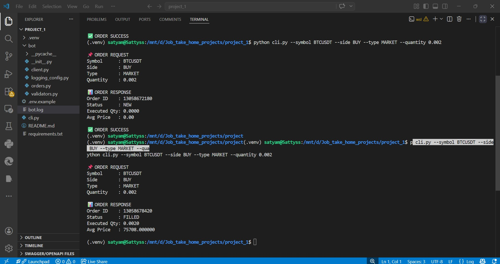

# Binance Futures Demo Dashboard

## Overview

This project started as a Python CLI trading bot and was extended into a small FastAPI dashboard for Binance Futures Demo trading.

It is intentionally scoped as a compact backend-heavy project that demonstrates:

- API integration with Binance Futures Demo
- input validation before trade execution
- secure environment-based configuration
- retry handling for Binance timestamp drift errors
- SQLite-backed activity history
- backend and UI testing for core flows

The goal is not to build a full trading platform. The goal is to showcase practical SDE strengths through a focused, working system.

## What It Does

- validates MARKET and LIMIT order requests
- executes demo orders against Binance Futures Demo
- retries once after syncing server time when Binance returns `-1021`
- records validation and execution activity in SQLite
- exposes a FastAPI health endpoint
- provides a simple HTML dashboard for manual testing and demos

## Tech Stack

- Python
- FastAPI
- Jinja2
- SQLite
- `python-binance`
- `unittest`

## Project Structure

```text
.
├── app.py
├── cli.py
├── requirements.txt
├── templates/
│   └── dashboard.html
├── tests/
│   ├── test_activity_store.py
│   ├── test_app.py
│   ├── test_client.py
│   ├── test_orders.py
│   ├── test_settings.py
│   └── test_validators.py
└── bot/
    ├── activity_store.py
    ├── client.py
    ├── logging_config.py
    ├── orders.py
    ├── settings.py
    └── validators.py
```

## Setup

### 1. Install dependencies

```bash
python3 -m pip install -r requirements.txt
```

### 2. Configure environment variables

Create a `.env` file using `.env.example` as reference:

```env
BINANCE_API_KEY=your_demo_api_key
BINANCE_API_SECRET=your_demo_api_secret
BINANCE_BASE_URL=https://demo-fapi.binance.com
```

Notes:

- `.env` is ignored by Git
- the dashboard never renders your API key or secret
- runtime SQLite data is also ignored by Git

## Run The App

### FastAPI dashboard

```bash
python3 -m uvicorn app:app --reload
```

Open:

```text
http://127.0.0.1:8000
```

### CLI flow

Market order:

```bash
python3 cli.py --symbol BTCUSDT --side BUY --type MARKET --quantity 0.002
```

Limit order:

```bash
python3 cli.py --symbol BTCUSDT --side BUY --type LIMIT --quantity 0.002 --price 30000
```

## Run Tests

```bash
python3 -m unittest discover -s tests -v
```

## Demo Flow

The dashboard is designed for a short, high-signal walkthrough:

1. Open the landing page and verify config readiness.
2. Validate an order request without executing it.
3. Execute a demo order with explicit confirmation.
4. Review execution response and persisted activity history.
5. Observe timestamp auto-retry behavior if Binance returns `-1021`.

## Engineering Decisions

### Why FastAPI + server-rendered HTML?

This keeps the project simple, fast to demo, and backend-focused. It highlights API design, validation, and operational handling without adding frontend framework complexity.

### Why SQLite?

SQLite is enough for a small portfolio project and demonstrates persistence, schema thinking, and clean separation from UI logic.

### Why keep the UI simple?

Because the strongest signal here is engineering judgment: a clean, usable interface on top of solid backend behavior.

## Reliability Features

- input validation before execution
- explicit execution confirmation
- secret-safe configuration display
- SQLite-backed activity history
- retry after Binance time synchronization errors
- modular code split between routes, validation, client setup, order execution, and persistence

## Current Scope

This project is intentionally limited to the parts that best demonstrate engineering fundamentals:

- order validation
- demo execution
- error handling
- persistence
- testing

It does not try to solve:

- full trading strategy automation
- authentication and multi-user flows
- portfolio analytics
- deployment infrastructure

## Screenshot

CLI output example:



## Resume / LinkedIn Positioning

You can describe this as:

`Built a FastAPI-based Binance Futures Demo trading dashboard with validated order execution, server-time sync retry handling, SQLite activity persistence, and end-to-end test coverage.`
