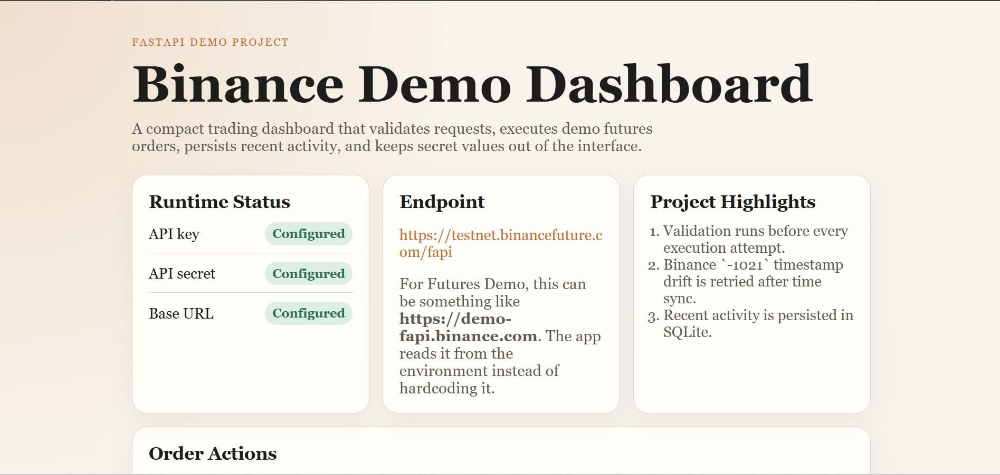
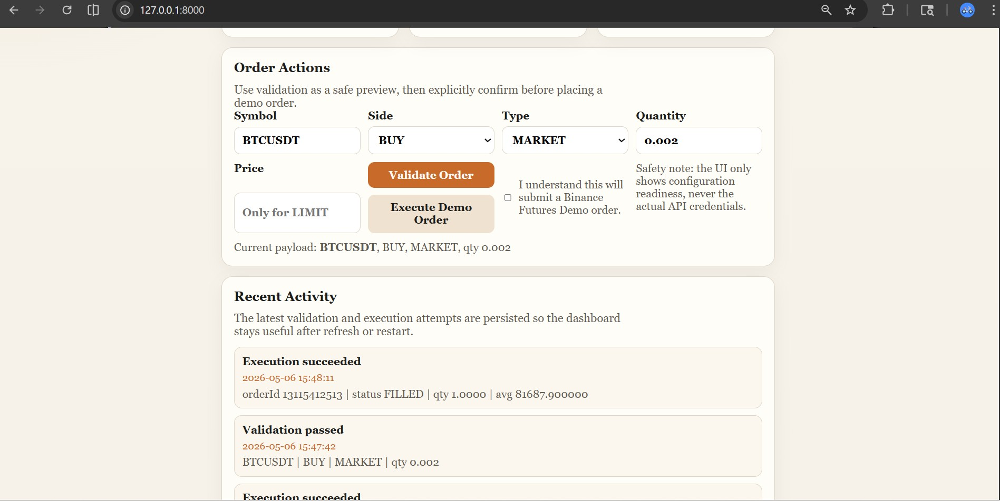

# Binance Futures Demo Dashboard

## Overview

This project is a FastAPI-based trading dashboard built on top of a Python Binance Futures Demo bot.

The scope is intentionally focused: demonstrate strong backend engineering fundamentals through a compact, working system rather than trying to build a full trading platform. The application validates orders, executes demo futures trades, handles Binance server-time drift, and persists recent activity for operational visibility.

## Key Capabilities

- validates MARKET and LIMIT orders before execution
- executes demo futures orders against Binance Futures Demo
- retries once after syncing server time when Binance returns `APIError(code=-1021)`
- persists recent validation and execution activity in SQLite
- exposes a health endpoint for runtime checks
- keeps API credentials out of the UI

## Architecture

The project is split into small modules with clear responsibilities:

- `app.py`: FastAPI routes and dashboard rendering
- `bot/settings.py`: environment-based configuration loading
- `bot/client.py`: Binance client creation
- `bot/orders.py`: order placement and time-sync retry logic
- `bot/validators.py`: order validation rules
- `bot/activity_store.py`: SQLite-backed recent activity persistence
- `templates/dashboard.html`: server-rendered UI
- `tests/`: coverage for validation, execution, retry logic, settings, and persistence

## Tech Stack

- Python
- FastAPI
- Jinja2
- SQLite
- `python-binance`
- `unittest`

## Screenshots

Landing page with configuration readiness and project highlights:



Order workflow with validation, execution, and persisted recent activity:



Original CLI flow:


## Local Setup

### 1. Install dependencies

```bash
python3 -m pip install -r requirements.txt
```

### 2. Configure environment variables

Create a `.env` file using `.env.example` as reference:

```env
BINANCE_API_KEY=your_demo_api_key
BINANCE_API_SECRET=your_demo_api_secret
BINANCE_BASE_URL=https://demo-fapi.binance.com
```

Notes:

- `.env` is ignored by Git
- runtime database files are ignored by Git
- the dashboard only shows configuration readiness, never raw secrets

## Running The Application

### FastAPI dashboard

```bash
python3 -m uvicorn app:app --reload
```

Open `http://127.0.0.1:8000`

### CLI mode

Market order:

```bash
python3 cli.py --symbol BTCUSDT --side BUY --type MARKET --quantity 0.002
```

Limit order:

```bash
python3 cli.py --symbol BTCUSDT --side BUY --type LIMIT --quantity 0.002 --price 30000
```

## Running Tests

```bash
python3 -m unittest discover -s tests -v
```

## Demo Walkthrough

1. Open the dashboard and verify environment readiness.
2. Validate an order request without execution.
3. Confirm and execute a demo order.
4. Review the order response and persisted activity feed.
5. Observe automatic recovery if Binance returns a timestamp drift error.

## Engineering Decisions

### FastAPI with server-rendered HTML

This keeps the project easy to run, easy to demo, and clearly backend-oriented. It highlights routing, validation, API integration, error handling, and response rendering without introducing unnecessary frontend complexity.

### SQLite for recent activity persistence

SQLite is a good fit for this scope. It demonstrates persistence, schema ownership, and separation of concerns while keeping setup friction very low.

### Explicit validation before execution

The app separates validation from execution so users can inspect a payload safely before sending a demo trade. This also makes the workflow easier to test and reason about.

### Retry handling for Binance `-1021`

The order layer detects time drift, synchronizes the client timestamp offset with Binance server time, and retries once. That adds realistic resilience without overengineering the solution.

## Reliability and Safety

- validation runs before every execution path
- demo execution requires explicit confirmation
- Binance time drift errors are retried after server-time sync
- recent activity is persisted in SQLite
- secret values are never rendered in the UI
- configuration is loaded from environment variables

## Scope

This project is intentionally optimized for signal over size. It focuses on:

- backend structure
- external API integration
- validation and error handling
- persistence
- testability
- a demoable interface

It does not attempt to cover:

- strategy automation
- portfolio analytics
- authentication and multi-user access
- deployment infrastructure

## Resume / LinkedIn Summary

`Built a FastAPI-based Binance Futures Demo dashboard with validated order execution, SQLite-backed recent activity persistence, and automatic retry handling for Binance server-time drift errors.`
